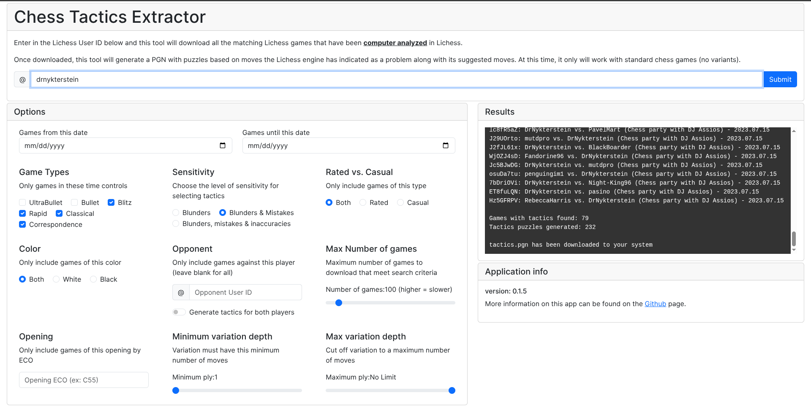
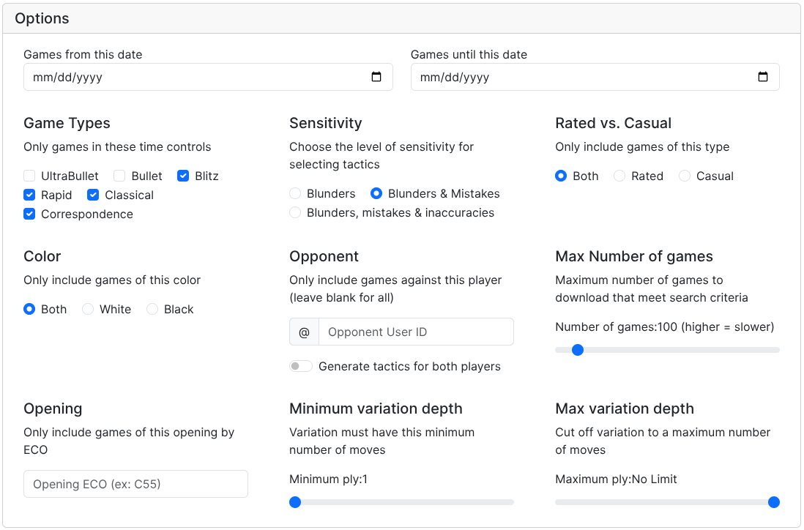
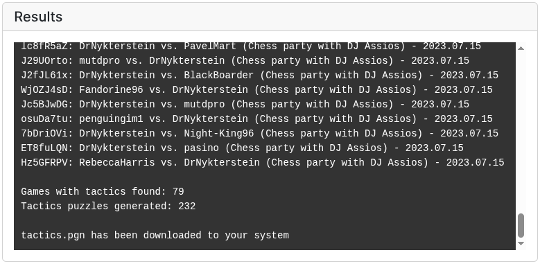

# Chess Tactics Extractor
Online tool that downloads your analyzed Lichess games and uses it to create tactics puzzles.



The idea for this application was inspired by a [video](https://www.youtube.com/watch?v=f8QrRbmaHxE) from Andras Toth on how to improve on your own if you don't have the benefit of a coach.  If you haven't seen this video, I would recommend doing so.

The basic idea that he outlines is that you should go over your games without having the engine immediately show you the best line. In the video, he shows how to change the settings to hide this feature.  After that, as you go through the game analysis, at any point where the engine indicates you made a mistake or blunder and the engine provides an optimal move you would then work out a new line and then check your results.

What this application does is go through your Lichess games and generates a PGN with every position in your games where an issue was found. It will indicate in the annotation what you previously played in this position and if the move you made was a mistake or a blunder. 

The resulting pgn was designed to work with [Chess PGN Trainer](https://rodpolako.github.io) to make it easy to work through the errors and test your knowledge, but you can use any training tool you'd like.

Unlike other tools that make tactics from your games, this one does not do any analysis itself. Instead, it requires that you analyze your game with the computer analysis in Lichess <ins>**before**</ins> using this tool. Only games that have been analyzed beforehand will be collected and processed. The benefit however, is that since the analysis has already been done, it is extrememly fast to generate the tactics file.  

Just how fast is it?  At the maximum game limit (1000 games), generation of the tactics pgn is under a minute. This <ins>**includes**</ins> the download of the games themselves which takes about 50 seconds since the lichess API limits downloads to 20 games/second.

## Setup Instructions ##
If you just want to use the app and and not bother hosting the page yourself, you can use the live link [here](https://rodpolako.github.io/cte). The latest version of this app will always be hosted there.

If you want to host a copy on your own environment and/or make changes:

1. Download & extract the zip into a folder and start a web server from there.
2. In a browser, point to index.html. On my own setup, the URL is ```localhost:8000/index.html``` but may be different for your setup. Refer to your web server for details.


## Usage ##
1. Enter in your Lichess User ID in the indicated field.


2. (Optional) Set any options you want in order to customize the games that get searched.


3. Click on Submit (or hit the enter key) to have the tool download the games and generate the tactics file.
4. The resulting ```tactics.pgn``` file will automatically download.


## FAQ ##
* **What about chess.com?** At this point, the chess.com API doesn't seem to have the same level of detail that is available in Lichess. If I can figure out a way to do something similar there, then I will add chess.com connectivity.  For now, it is Lichess only.
* **What about other variants (Chess960, Crazyhouse, Atomic, etc.)?**  This may come in a future version, depending on a number of factors.  No plans to incorporate it at this time.
